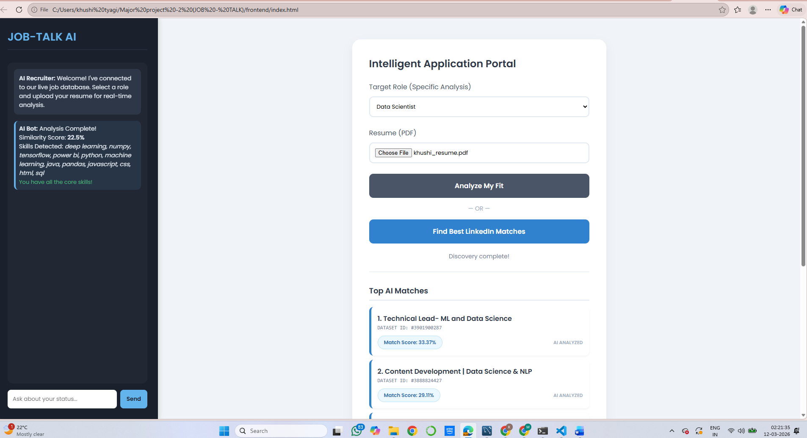
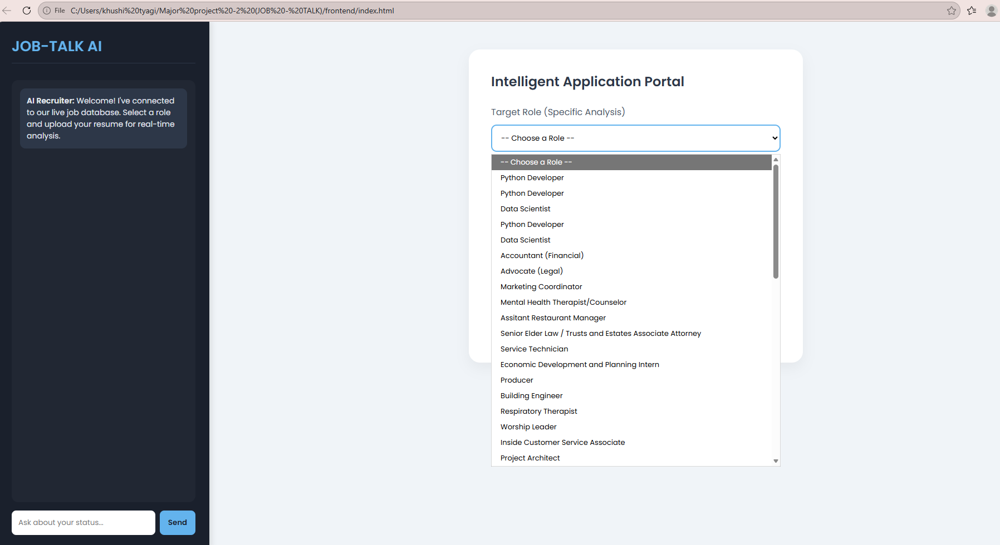
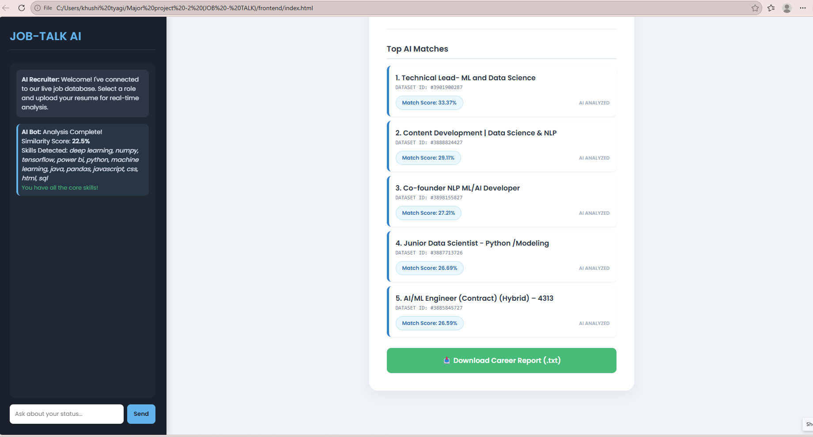
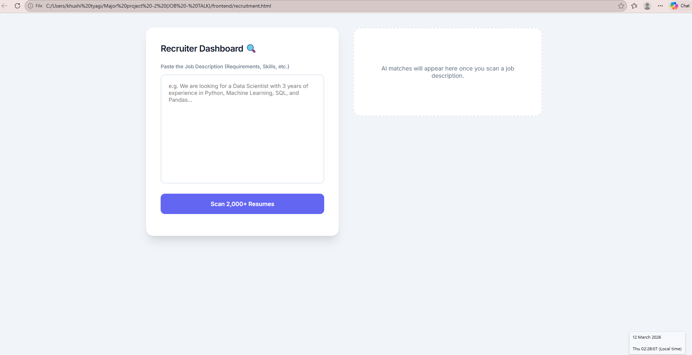
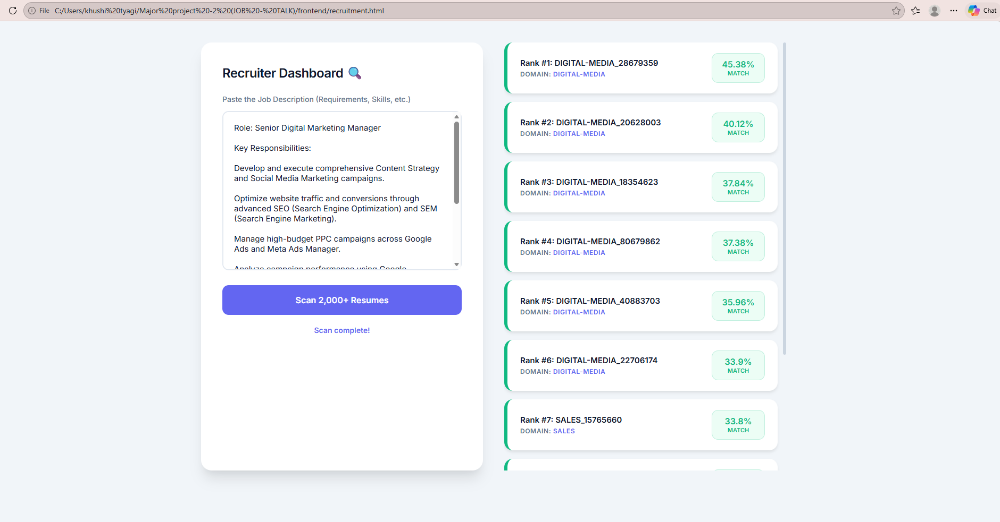

# JOB-TALK AI: Intelligent Recruitment Ecosystem

**Developed by:** [Khushi Tyagi](https://github.com/khushityaagi)  
*B.Tech ( Data Science )*

A dual-sided recruitment system utilizing **TF-IDF Vectorization** and **RAG-based AI** to automate job discovery and candidate sourcing.

---

# Technical Validation & User Interface

Visual documentation demonstrating the system's ability to process large-scale datasets and generate analytical output.

---

## 1. System Dashboard Overview

Central interface for candidate interaction, featuring resume upload and real-time analysis portals.



---

## 2. Live Job Database Synchronization

Proof of dynamic API integration fetching specific roles from the **123,000+ LinkedIn job record database**.



---

## 3. Machine Learning Matching Output

Technical breakdown of similarity scores and skill-gap analysis generated via **TF-IDF Vectorization**.



---

## 4. Recruiter Intelligence Dashboard

Specialized module for HR professionals to define job requirements and initiate automated talent sourcing.



---

## 5. Strategic Talent Ranking Results

Output of the recruitment engine ranking candidates by **mathematical alignment to job descriptions**.



---

# Technical Architecture

The system uses a **Retrieval-Augmented Generation (RAG)** workflow combined with **Vector Search** to deliver accurate candidate-job matching.

### Vectorization
Raw text from resumes and job descriptions is converted into **numerical vectors using TF-IDF**.

### Matching
**Cosine Similarity** calculates the similarity score between candidate and job vectors.

### Generative AI Layer
A chatbot powered by **Google Gemini 1.5 Flash** retrieves contextual information from the **MySQL database** to provide personalized career insights.

---

# Tech Stack

### Backend
- FastAPI (Python)

### AI Engine
- Google Gemini 1.5 Flash

### Machine Learning
- Scikit-Learn
  - TF-IDF Vectorizer
  - Cosine Similarity

### Database
- MySQL  
(Persistent storage for resumes, job descriptions, and chat context)

### Frontend
- HTML5  
- CSS3  
- Vanilla JavaScript

### Document Processing
- pdfplumber
- python-docx

---

# Dataset Specifications

The system was validated using **large-scale industry datasets** to simulate real-world recruitment scenarios.

### Candidate Dataset
- **2,484 resumes**
- **24 industry sectors**
- Source: Snehaan Bhawal Resume Dataset

### Job Dataset
- **123,842 LinkedIn job postings**
- Source: Arsh Koneru LinkedIn Jobs Dataset

---

# System Workflow

1. User uploads a **resume (PDF/DOCX)**.
2. Resume text is extracted using **pdfplumber / python-docx**.
3. Resume content is converted into **TF-IDF vectors**.
4. Job descriptions from the dataset are also vectorized.
5. **Cosine Similarity** calculates the best matching jobs.
6. System returns:
   - Best job matches
   - Similarity scores
   - Skill gap insights.
7. Recruiters can also:
   - Upload job descriptions
   - Search candidate database
   - Rank candidates automatically.
8. Project Structure

```text
MAJOR PROJECT -2 (JOB - TALK)/
├── backend/
│   ├── data/                 # Raw dataset storage
│   ├── job description/      # Processed LinkedIn job data
│   ├── chatbot.py            # Gemini 1.5 Flash RAG logic
│   ├── main.py               # FastAPI application entry point
│   ├── matching.py           # TF-IDF & Cosine Similarity logic
│   ├── parser.py             # PDF/Docx text extraction
│   ├── data_prep.py          # Dataset cleaning and preprocessing
│   └── all_resumes.csv       # Processed resume database
├── frontend/
│   ├── index.html            # Candidate Portal UI
│   └── recruitment.html      # Recruiter Dashboard UI
└── screenshots/              # UI Proof & Evidence
---

# Execution Guide

## 1. Backend Setup

```bash
# Navigate to backend directory
cd backend

# Create virtual environment
python -m venv .venv

# Activate environment

# Windows
.venv\Scripts\activate

