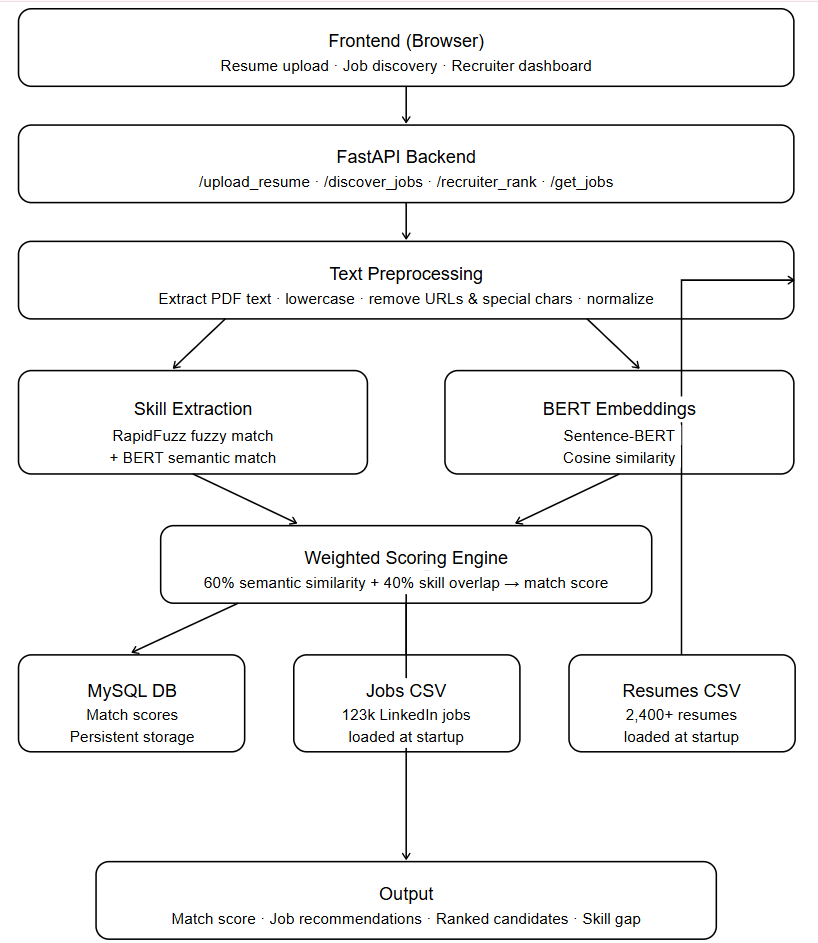
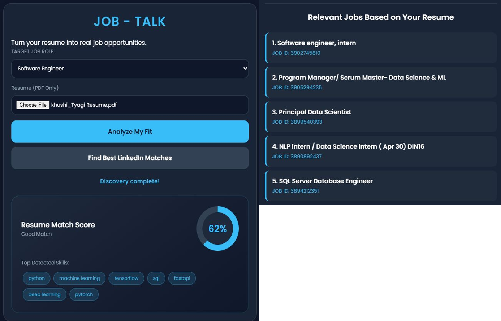
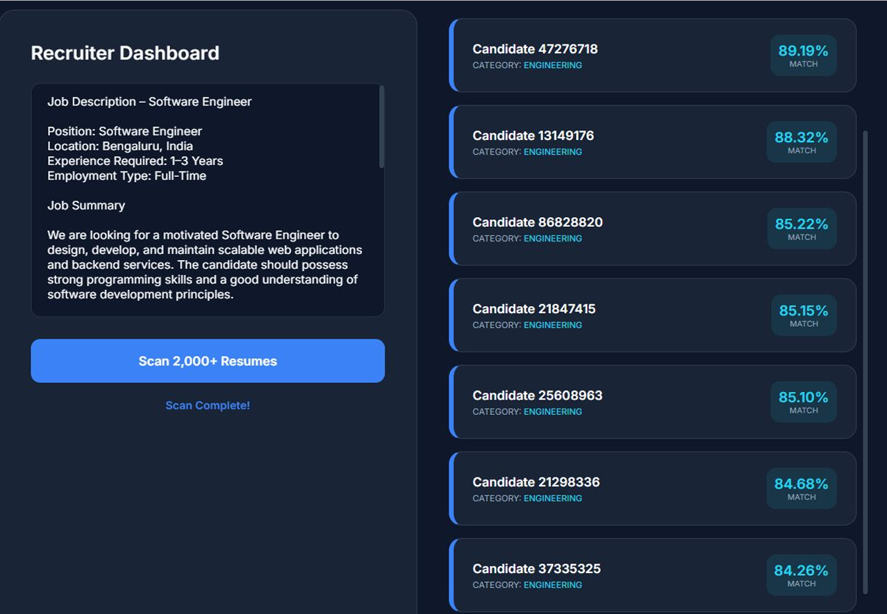
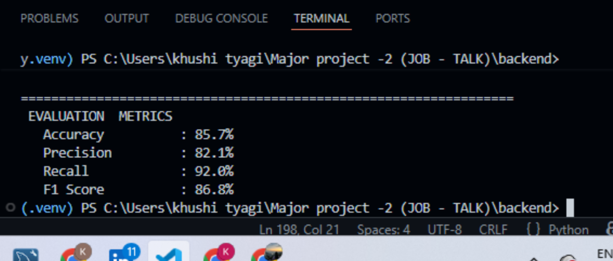

# JOB-TALK AI
### AI-Based Recruitment & Resume Screening Platform

JOB-TALK AI is a recruitment support platform designed to optimize resume screening, semantic job matching, and job recommendations using NLP, Cosine Similarity, and Sentence-BERT embeddings.

---

## Objectives
- Automate resume screening and candidate ranking using AI and semantic matching techniques.
- Recommend relevant jobs to candidates based on their current resume by matching it with job descriptions using Sentence-BERT and Cosine Similarity.
- Reduce recruiters' manual effort in finding relevant candidates for a given job description.

---

## Tech Stack
| Layer | Tools |
|---|---|
| Backend | Python, FastAPI |
| AI / NLP | Sentence-BERT (`paraphrase-MiniLM-L3-v2`), Cosine Similarity, RapidFuzz |
| Database | MySQL |
| Frontend | HTML, CSS, JavaScript |

---

## Dataset (Kaggle)
- **2,400+ resumes** across multiple industries
- **123,000+ LinkedIn job postings** with descriptions and skills

---

## API Endpoints

| Endpoint | Method | Description |
|---|---|---|
| `/discover_jobs/` | POST | Matches uploaded resume to top job listings |
| `/upload_resume/` | POST | Scores resume against a specific job |
| `/recruiter_rank/` | POST | Ranks all resumes in DB for a given job |
| `/recruiter_scan/` | POST | Scans candidate pool using a job description |
| `/get_jobs/` | GET | Returns available job listings |

---

## System Architecture

  

---

## Applicant Interface

  

---

## Hiring Dashboard

  

---

## Performance Metrics

  

---

## Future Enhancements
- Real-time LinkedIn integration
- Fine-tuned domain-specific recruitment models
- Cloud deployment (AWS / GCP)
- AI interview assistant

---

## Developer
**Khushi Tyagi**
